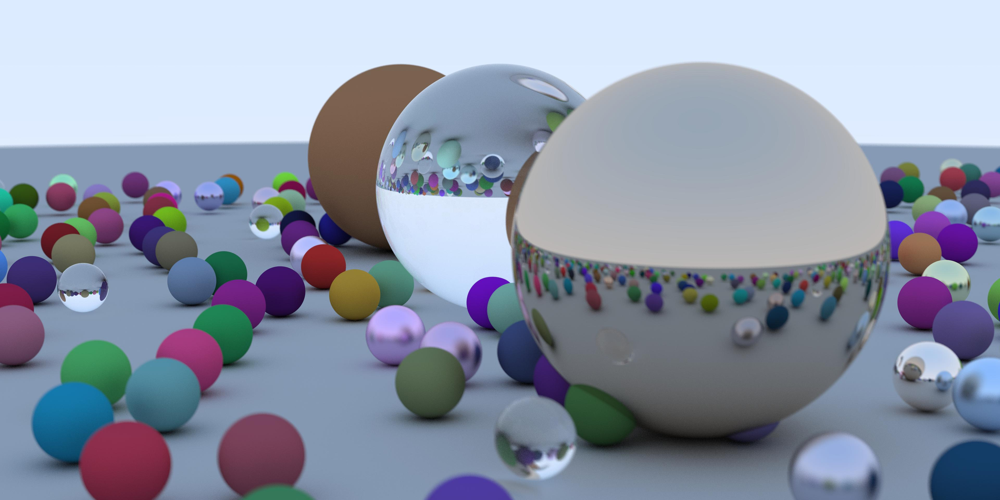

# raytracer-rs

A simple raytracer written in rust.
Based on the [Ray Tracing in a Weekend](http://www.realtimerendering.com/raytracing/Ray%20Tracing%20in%20a%20Weekend.pdf) book.

## Example


## Usage
Running
```
cargo run --release > hello.ppm
```
will generate image in ppm format similar to the example above. Current image size is 3840x1920 so it may take an hour or more to render it.
